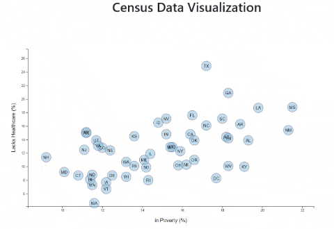

# Census Data Visualization

- - -

I created a interactive scatterplot using D3 to visualize US Census data.

- - -

## Where is the data from?

The data set is based on 2014 ACS 1-year estimates from the [US Census Bureau](https://data.census.gov/cedsci/). The current data set includes data on rates of income, obesity, poverty, etc. by state. MOE stands for "margin of error."

### What I did (D3 Dabbler):

* Created a scatter plot between two of the data variables: `Healthcare vs. Poverty`.

* Using the D3 techniques, created a scatter plot that represents each state with circle elements.

* Included state abbreviations in the circles.

* Incorporated d3-tip: Using the `d3-tip.js` plugin developed by [Justin Palmer](https://github.com/Caged), incorporated tooltips to the circles and displayed each tooltip with the data when you mouseover.

- - -

The data is provided by UCSD Extension: Data Science and Visualization Bootcamp.

- - -

Contact:

Email: arcebri1@gmail.com